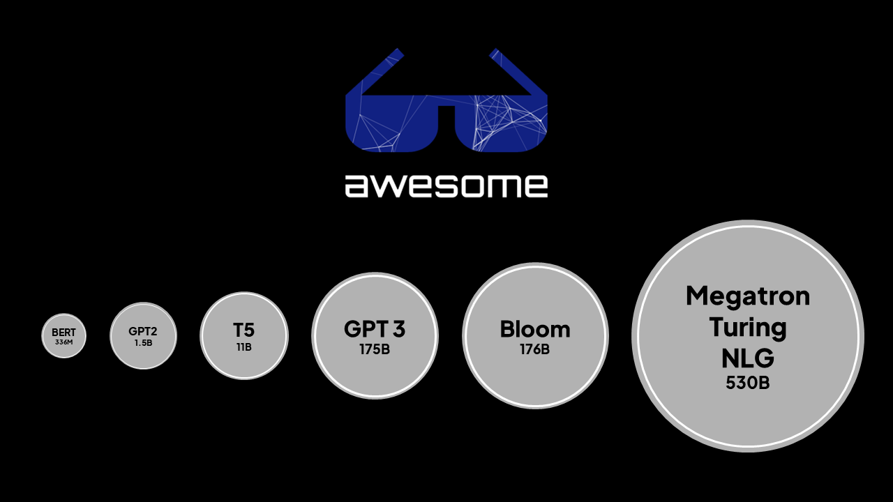

<h1 id="top" align="center">Awesome LLM</h1>
<p align="center"><a href="https://awesome.re"></a></p>
<p align="center">Awesome series for Large Language Model(LLM)s</p>

<p align="center"></p>

## Contents

- [Models](#models)
   - [Overview](#overview)
   - [Open models](#open-models)
   - [Projects](#projects)
   - [GitHub repositories](#github-repositories)
   - [HuggingFace repositories](#huggingface-repositories)
   - [Commercial models](#commercial-models)
      - [GPT](#gpt)
      - [Bard](#bard)
      - [Codex](#codex)
- [Datasets](#datasets)
- [Benchmarks](#benchmarks)
- [Materials](#materials)
   - [Papers](#papers)
   - [Posts](#posts)
   - [Projects](#projects)
- [Contributing](#contributing)

## Models

### Overview

| Name                       | Parameter size    | Announcement date |
|----------------------------|-------------------|-------------------|
| BERT-Large (336M)          | 336 million       | 2018              |
| T5 (11B)                   | 11 billion        | 2020              |
| Gopher (280B)              | 280 billion       | 2021              |
| GPT-J (6B)                 | 6 billion         | 2021              |
| LaMDA (137B)               | 137 billion       | 2021              |
| Megatron-Turing NLG (530B) | 530 billion       | 2021              |
| T0 (11B)                   | 11 billion        | 2021              |
| Macaw (11B)                | 11 billion        | 2021              |
| GLaM (1.2T)                | 1.2 trillion      | 2021              |
| T5 FLAN (540B)             | 540 billion       | 2022              |
| OPT-175B (175B)            | 175 billion       | 2022              |
| ChatGPT (175B)             | 175 billion       | 2022              |
| GPT 3.5 (175B)             | 175 billion       | 2022              |
| AlexaTM (20B)              | 20 billion        | 2022              |
| Bloom (176B)               | 176 billion       | 2022              |
| Bard                       | Not yet announced | 2023              |
| GPT 4                      | Not yet announced | 2023              |
| AlphaCode (41.4B)          | 41.4 billion      | 2022              |
| Chinchilla (70B)           | 70 billion        | 2022              |
| Sparrow (70B)              | 70 billion        | 2022              |
| PaLM (540B)                | 540 billion       | 2022              |
| NLLB (54.5B)               | 54.5 billion      | 2022              |
| Galactica (120B)           | 120 billion       | 2022              |
| UL2 (20B)                  | 20 billion        | 2022              |
| Jurassic-1 (178B)          | 178 billion       | 2022              |
| LLaMA (65B)                | 65 billion        | 2023              |
| Stanford Alpaca (7B)       | 7 billion         | 2023              |
| GPT-NeoX 2.0 (20B)         | 20 billion        | 2023              |
| BloombergGPT               | 50 billion        | 2023              |
| Dolly                      | 6 billion         | 2023              |
| Jurassic-2                 | Not yet announced | 2023              |
| OpenAssistant LLaMa        | 30 billion        | 2023              | 

[:arrow_up: Go to top](#top)

### Open models

- [T5 (11B)](https://huggingface.co/docs/transformers/model_doc/t5) - Announced by Google / 2020
- [T5 FLAN (540B)](https://huggingface.co/google/flan-t5-xxl) - Announced by Google / 2022
- [T0 (11B)](https://huggingface.co/bigscience/T0pp) - Announced by BigScience (HuggingFace) / 2021
- [OPT-175B (175B)](https://huggingface.co/docs/transformers/model_doc/opt) - Announced by Meta / 2022
- [UL2 (20B)](https://ai.googleblog.com/2022/10/ul2-20b-open-source-unified-language.html) - Announced by Google / 2022
- [Bloom (176B)](https://huggingface.co/bigscience/bloom) - Announced by BigScience (HuggingFace) / 2022
- [BERT-Large (336M)](https://huggingface.co/bert-large-uncased) - Announced by Google / 2018
- [GPT-NeoX 2.0 (20B)](https://github.com/EleutherAI/gpt-neox) - Announced by EleutherAI / 2023
- [GPT-J (6B)](https://huggingface.co/EleutherAI/gpt-j-6B) - Announced by EleutherAI / 2021
- [Macaw (11B)](https://macaw.apps.allenai.org/) - Announced by AI2 / 2021
- [Stanford Alpaca (7B)](https://crfm.stanford.edu/2023/03/13/alpaca.html) - Announced by Stanford University / 2023

[:arrow_up: Go to top](#top)

### Projects

- [Visual ChatGPT](https://github.com/microsoft/visual-chatgpt) - Announced by Microsoft / 2023
- [LMOps](https://github.com/microsoft/lmops) - Large-scale Self-supervised Pre-training Across Tasks, Languages, and Modalities.

[:arrow_up: Go to top](#top)

### Commercial models

#### GPT

- [GPT 4 (Parameter size unannounced, gpt-4-32k)](https://openai.com/product/gpt-4) - Announced by OpenAI / 2023
- [ChatGPT (175B)](https://openai.com/blog/chatgpt/) - Announced by OpenAI / 2022
- [ChatGPT Plus (175B)](https://openai.com/blog/chatgpt-plus/) - Announced by OpenAI / 2023
- [GPT 3.5 (175B, text-davinci-003)](https://platform.openai.com/docs/models/gpt-3) - Announced by OpenAI / 2022

[:arrow_up: Go to top](#top)

#### Bard

- [Bard](https://bard.google.com/) - Announced by Google / 2023

[:arrow_up: Go to top](#top)

#### Codex

- [Codex (11B)](https://openai.com/blog/openai-codex/) - Announced by OpenAI / 2021

[:arrow_up: Go to top](#top)

## Datasets

- [Sphere](https://github.com/facebookresearch/Sphere) - Announced by Meta / 2022
   - `134M` documents split into `906M` passages as the web corpus.
- [Common Crawl](https://commoncrawl.org/)
   - `3.15B` pages and over than `380TiB` size dataset, public, free to use.
- [SQuAD 2.0](https://rajpurkar.github.io/SQuAD-explorer/)
   - `100,000+` question dataset for QA.
- [Pile](https://pile.eleuther.ai/)
   - `825 GiB diverse`, open source language modelling data set.
- [RACE](https://www.cs.cmu.edu/~glai1/data/race/)
   - A large-scale reading comprehension dataset with more than `28,000` passages and nearly `100,000` questions.
- [Wikipedia](https://huggingface.co/datasets/wikipedia)
   - Wikipedia dataset containing cleaned articles of all languages.

[:arrow_up: Go to top](#top)

## Benchmarks

- [BIG-bench](https://github.com/google/BIG-bench)

[:arrow_up: Go to top](#top)

## Materials

### Papers

- [Megatron-Turing NLG (530B)](https://arxiv.org/abs/2201.11990) - Announced by NVIDIA and Microsoft / 2021
- [LaMDA (137B)](https://arxiv.org/abs/2201.08239) - Announced by Google / 2021
- [GLaM (1.2T)](https://arxiv.org/pdf/2112.06905.pdf) - Announced by Google / 2021
- [PaLM (540B)](https://arxiv.org/abs/2204.02311) - Announced by Google / 2022
- [AlphaCode (41.4B)](https://www.deepmind.com/blog/competitive-programming-with-alphacode) - Announced by DeepMind / 2022
- [Chinchilla (70B)](https://arxiv.org/abs/2203.15556) - Announced by DeepMind / 2022
- [Sparrow (70B)](https://www.deepmind.com/blog/building-safer-dialogue-agents) - Announced by DeepMind / 2022
- [NLLB (54.5B)](https://arxiv.org/abs/2207.04672) - Announced by Meta / 2022
- [LLaMA (65B)](https://research.facebook.com/publications/llama-open-and-efficient-foundation-language-models/) - Announced by Meta / 2023
- [AlexaTM (20B)](https://arxiv.org/abs/2208.01448) - Announced by Amazon / 2022
- [Gopher (280B)](https://www.deepmind.com/blog/language-modelling-at-scale-gopher-ethical-considerations-and-retrieval) - Announced by DeepMind / 2021
- [Galactica (120B))(https://arxiv.org/abs/2211.09085) - Announced by Meta / 2022

### Posts

- [Luminous (13B)](https://www.aleph-alpha.com/luminous-explore-a-model-for-world-class-semantic-representation) - Announced by Aleph Alpha / 2021
- [Turing NLG (17B)](https://www.microsoft.com/en-us/research/blog/turing-nlg-a-17-billion-parameter-language-model-by-microsoft/) - Announced by Microsoft / 2020
- [Claude (52B)](https://www.anthropic.com/index/introducing-claude) - Announced by Anthropic / 2021
- [Minerva (Parameter size unannounced)](https://ai.googleblog.com/2022/06/minerva-solving-quantitative-reasoning.html) - Announced by Google / 2022
- [BloombergGPT (50B)](https://www.bloomberg.com/company/press/bloomberggpt-50-billion-parameter-llm-tuned-finance/) - Announced by Bloomberg / 2023
- [Dolly (6B)](https://www.databricks.com/blog/2023/03/24/hello-dolly-democratizing-magic-chatgpt-open-models.html) - Announced by Databricks / 2023
- [Jurassic-1](https://www.ai21.com/blog/announcing-ai21-studio-and-jurassic-1) - Announced by AI21 / 2022
- [Jurassic-2](https://www.ai21.com/blog/introducing-j2) - Announced by AI21 / 2023

[:arrow_up: Go to top](#top)

### Projects

- [BigScience](https://bigscience.huggingface.co/) - Maintained by HuggingFace ([Twitter](https://twitter.com/BigScienceLLM)) ([Notion](https://bigscience.notion.site/BLOOM-BigScience-176B-Model-ad073ca07cdf479398d5f95d88e218c4))
- [HuggingChat](https://www.producthunt.com/posts/hugging-chat) - Maintained by HuggingFace / 2023

### GitHub repositories

- [Stanford Alpaca](https://github.com/tatsu-lab/stanford_alpaca) -  - A repository of Stanford Alpaca project,  a model fine-tuned from the LLaMA 7B model on 52K instruction-following demonstrations.
- [Dolly](https://github.com/databrickslabs/dolly) -  - A large language model trained on the Databricks Machine Learning Platform.
- [AutoGPT](https://github.com/Significant-Gravitas/Auto-GPT) -  - An experimental open-source attempt to make GPT-4 fully autonomous.
- [dalai](https://github.com/cocktailpeanut/dalai) -  - The cli tool to run LLaMA on the local machine.
- [alpaca-lora](https://github.com/tloen/alpaca-lora) -  - Instruct-tune LLaMA on consumer hardware.
- [llama_index](https://github.com/jerryjliu/llama_index) -  - A project that provides a central interface to connect your LLM's with external data.
- [openai/evals](https://github.com/openai/evals) -  - A curated list of reinforcement learning with human feedback resources.
- [trlx](https://github.com/CarperAI/trlx) -  - A repo for distributed training of language models with Reinforcement Learning via Human Feedback. (RLHF)

[:arrow_up: Go to top](#top)

## HuggingFace repositories

- [OpenAssistant SFT 6](https://huggingface.co/OpenAssistant/oasst-sft-6-llama-30b-xor) - 30 billion LLaMa-based model made by HuggingFace for the chatting conversation.

[:arrow_up: Go to top](#top)

## Contributing

We welcome contributions to the Awesome LLMOps list! If you'd like to suggest an addition or make a correction, please follow these guidelines:

1. Fork the repository and create a new branch for your contribution.
2. Make your changes to the README.md file.
3. Ensure that your contribution is relevant to the topic of LLM.
4. Use the following format to add your contribution:
  ```markdown
  [Name of Resource](Link to Resource) - Description of resource
  ```
5. Add your contribution in alphabetical order within its category.
6. Make sure that your contribution is not already listed.
7. Provide a brief description of the resource and explain why it is relevant to LLM.
8. Create a pull request with a clear title and description of your changes.

We appreciate your contributions and thank you for helping to make the Awesome LLM list even more awesome!

[:arrow_up: Go to top](#top)
